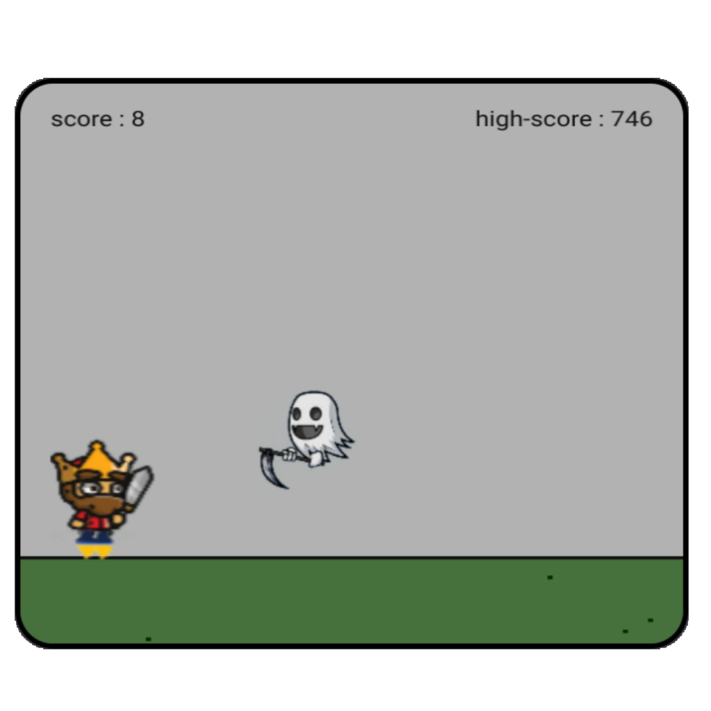

# COLBAKING
---
Nothing much fancy about it, [ColbaKing](bruttazz.github.io/colbaking "Game") is just a regular old school javascript game (more like a clone of Chrome's dino-game).
Uses basic javascript's `requestAnimation` method to manipulate HTML5 canvas.

Game controls are simple. In pc, use `spacebar` or `W` for jumping and `H` for make the king laugh (not important though). In touch screen devices, all you have to do is tap the screen again and again (No laughing option here :). 
